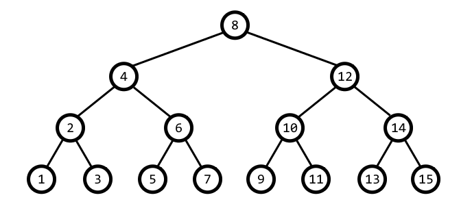
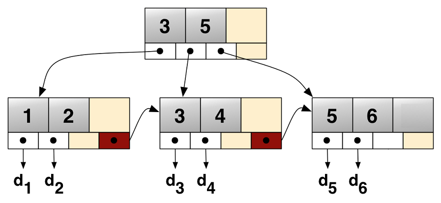
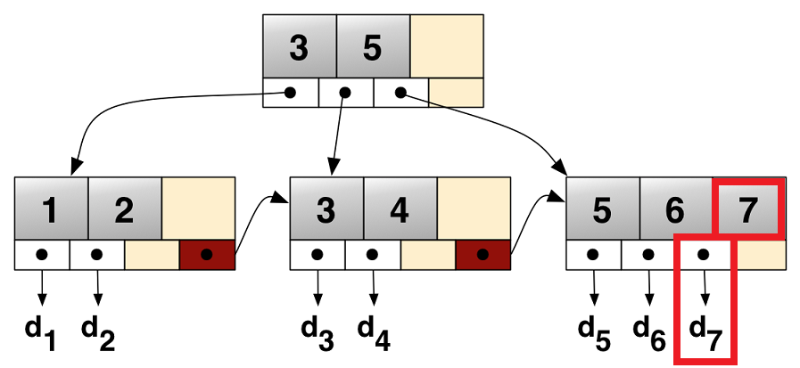

background-image: url(img/GoodBadUgly2.jpg)
background-size: cover

# Dobry, Sprawny &amp; Szybki

## Szymon Kulec @Scooletz

???

Mam dla Was dobrą, i złą wiadomość. Jedną wiadomość. Chmura publiczna, w tym Azure, nadchodzi aby zjeść Wasze serwery na śniadanie. Zrobi to, bo rozumie dane i wie jak przetworzyć je w sprawny sposób. Oczywiście każdy z nas zna jeden ze sposóbów na szybkie przetworzenie danych. Wystarczy...

---

background-image: url(img/gold.jpg)
background-size: cover

## Wystarczy...

- obrabować bank

--

- kupić cały RAM

--

- umieścić dane w RAMie

--

- i będzie działać (TM)

???

Takie rozwiązanie, nie tylko ze względów moralnych, nie jest optymalne.

---

background-image: url(img/themis.jpg)
background-size: cover

## ...And Justice for All

--

- koszt vs zyski

--

- multi-tenant

--

- izolacja

--

- ciepłe dane, zimne dane

--

- kolokacja

---

background-image: url(img/gbu-3.jpg)
background-size: cover

???

- Azure Stream Analytics - Trill
- Cosmos DB - indeksy i BW-Tree+
- Service Fabric - stan i zarządzanie pamięcią

---

background-image: url(img/good.jpg)
background-size: cover

## Dobry: Stream Analytics

--

- przetwarzanie strumieniowe (zdarzeń, danych)

--

- dostępne jako usługa (€0.102/hour)

--

- możliwe wejścia: IOT, Event Hub, Kafka

--

- odpowiedź na Spark, Druid i inne

---

background-image: url(img/good.jpg)
background-size: cover

## Dobry: Stream Analytics - przykład

```sql
SELECT System.Timestamp AS WindowEnd, COUNT(*) AS FraudulentCalls
INTO "MyPBIoutput"

FROM "CallStream" CS1 TIMESTAMP BY CallRecTime
JOIN "CallStream" CS2 TIMESTAMP BY CallRecTime
ON CS1.CallingIMSI = CS2.CallingIMSI
AND DATEDIFF(ss, CS1, CS2) BETWEEN 1 AND 5

WHERE CS1.SwitchNum != CS2.SwitchNum

GROUP BY TumblingWindow(Duration(second, 1))
```

???

Ok. Co kryje się pod maską tego mechanicznego rumaka?

---

background-image: url(img/good.jpg)
background-size: cover

## Dobry: Stream Analytics - Trill

--

- Trill - _trillion  events  per  day_

--

- C&#35; - High Level Language

--

- 100 do 10000 razy szybszy od konkurencji (przy pewnych założeniach)

--

- jednowątkowy (prawie)

???

Wiele wątków do wstawiania i wyjmowania danych

---

background-image: url(img/good.jpg)
background-size: cover

## Dobry: Stream Analytics - Trill - Architektura

### Pojedyncze zdarzenie

```csharp
On(new Item { Id = 5, Operation = Operations.EmailSent, UserId = 5 });
```

--

```csharp
On(new Item { Id = 6, Operation = Operations.SmsSent, UserId = 5 });
```

--

```csharp
On(new Item { Id = 7, Operation = Operations.SmsSent, UserId = 5 });
```

???

- przesyłanie pojedynczych zdarzeń
- reagowanie na pojedyncze zdarzenia

---

background-image: url(img/good.jpg)
background-size: cover

## Dobry: Stream Analytics - Trill - Architektura

### Tablice zdarzeń

```csharp
On(new[]{
    new Item { Id = 5, Operation = Operations.EmailSent, UserId = 5 },
    new Item { Id = 6, Operation = Operations.SmsSent, UserId = 5 },
    new Item { Id = 7, Operation = Operations.SmsSent, UserId = 5 }
});
```

???

- batching, smart batching
- przesyłanie, deserializacja, przetwarzania amortyzuje część kosztów

---

background-image: url(img/good.jpg)
background-size: cover

## Dobry: Stream Analytics - Trill - Architektura

### Kolumny

```csharp
// tradycyjne obiekty
On(new[]{
    new Item { Id = 5, Operation = Operations.EmailSent, UserId = 5 },
    new Item { Id = 6, Operation = Operations.SmsSent, UserId = 5 },
    new Item { Id = 7, Operation = Operations.SmsSent, UserId = 5 }
});
```

--

```csharp
// zapisane kolumnowo
On(
    new [] {5, 6, 7}, // ids
    new [] {Ops.EmailSent, Ops.SmsSent, Ops.SmsSent}, // operations
    new [] {5, 5, 5}) // userid
});
```

???

- Columnar DBs
- dane podobne razem, kolokacja, CPU cache
- możliwe lepsze upakowanie, alignment, encoding
- problem kiedy kończy się kolumna

---

background-image: url(img/good.jpg)
background-size: cover

## Dobry: Stream Analytics - Trill - Architektura

### Kolumnowy batch

```csharp
// kolumny
On(
    new []{5, 6, 7}, // ids
    new []{Ops.EmailSent, Ops.SmsSent, Ops.SmsSent}, // operations
    new [] {5, 5, 5}) // userid
});
```

--

```csharp
// kolumnowy batch
class Batch
{
    public Memory<int> Ids;
    public Memory<Operations> Operations;
    public Memory<int> UserIds;
}
```

???

- cały czas:
  - dane podobne razem, kolokacja, CPU cache
  - możliwe lepsze upakowanie, alignment, encoding
- ograniczony rozmiar
- brak problemu końca

- Trill pisany jeszcze zanim było Memory/Span/itp miał własne struktury

---

background-image: url(img/good.jpg)
background-size: cover

## Dobry: Stream Analytics - Trill - Implementacja

```csharp
class DataBatch
{
    long[] SyncTime;
    long[]OtherTime;
    Bitvector BV
}
```

--

```csharp
class UserData_Gen : DataBatch
{
    long[] col_ClickTime;
    long[] col_UserId;
    long[] col_AdId;
}
```

???

- pierwsza struktura to oryginalny DataBatch z Trilla
- druga - wygenerowany batch na potrzeby zliczania klinięć w reklamy

---

background-image: url(img/good.jpg)
background-size: cover

## Dobry: Stream Analytics - Trill - Przykład

### Zliczanie reklam w czasie dla wybranych użytkowników

```csharp
var query = str
    .Where(e => e.UserId % 100 < 5)
    .Select(e => { e.AdId })
    .GroupApply(
        e =>e.AdId,
        s => s.Window(5min).Aggregate(w => w.Count()));
```

---

background-image: url(img/good.jpg)
background-size: cover

## Dobry: Stream Analytics - Trill - Przykład

### Zliczanie reklam w czasie dla wybranych użytkowników

```csharp
var query = str
    .Where(e => e.UserId % 100 < 5)
    // ...
```

--

```csharp
void On(UserData_Gen batch)
{
    batch.BV.MakeWritable(); // bitvector copy on write
    for(int i=0; i<batch.Count; i++)
    if((batch.BV[i]==0) && !(batch.col_UserId[i] % 100 < 5))
    {
        batch.BitVector[i] = 1;
    }
    nextOperator.On(batch);
}
```

???

- 0 - dane obecne,
- 1 - oznacza pominięcie

---

background-image: url(img/good.jpg)
background-size: cover

## Dobry: Stream Analytics - Trill - więcej

--

- _Trillium_ - serializer dla kolumn, 15X-20X szybszy od AVRO

--

- _MultiString_ => `Memory<char>`

--

- tablice w batchach posiadają pule => `MemoryPool<>`

--

- `Expression<Func<T>>` dla generowania agregatów

---

background-image: url(img/gbu-3.jpg)
background-size: cover

???

- Trill, niesamowite ciekawe narzędzie
- napisane trochę przed erą performance'u w .NET
- pokazuje, że nawet w High Level Language można pisać wydajne elementy

- przejdźmy do CosmosDB i tego w jaki sposób dba o ciełe/zimne dane i niedotykanie wszystkich gałęzi w drzewie

---

background-image: url(img/bad.jpg)
background-size: cover

## Sprawny: Cosmos DB

> Azure Cosmos DB is Microsoft’s proprietary globally-distributed, multi-model database service "for managing data at planet-scale" launched in May 2017. It is schema-agnostic, horizontally scalable and generally classified as a NoSQL database.

--

- skalowalna

- replikacja: master-slave, master-master

- agnostyczna wobec schematu

- indeksuje dowolny JSON

- zna podział na dane ciepłe i zimne

---

background-image: url(img/bad.jpg)
background-size: cover

## Sprawny: Cosmos DB - podstawy baz danych



???

- tradycyjne "pierwsze drzewo"
- wyszukiwanie w lewo - mniejszy klucz, w prawo - większy
- może być zrównoważone (odpowiednio mała wysokość) lub nie (degeneracja do listy)
- zrównoważone ma O(log n) złożoność
- co jeśli byłoby na dysku... (dociąganie danych)

---

background-image: url(img/bad.jpg)
background-size: cover

## Sprawny: Cosmos DB - podstawy baz danych - B+



???

- posiada zdecydowanie większe strony (4kb lub 8 kb)
- kilka górnych page'y może być cache'owanych w RAM
- dane tylko na ostatnim poziomie
- bardzo szerokie (często wystarczy kilka poziomów)

- dlaczego SQL Server lubi rosnące idki?

---

background-image: url(img/bad.jpg)
background-size: cover

## Sprawny: Cosmos DB - podstawy baz danych - B+



---

background-image: url(img/ugly.jpg)
background-size: cover

## Szybki: Service Fabric

---


background-image: url(img/GoodBadUgly2.jpg)
background-size: cover

# Dobry, Sprawny &amp; Szybki

## Szymon Kulec @Scooletz