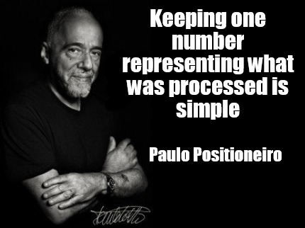

## The Only Thing That Matters

### Szymon Kulec

[@Scooletz](https://twitter.com/Scooletz)

[https://blog.scooletz.com](https://blog.scooletz.com)

---


NOTE: steak. Well-done: architectural, RAW: low-level presentation, THIS: cow

--


---

## Hardware

--

### Ancient technology


--

### HDD

- a spinning thingy
- sequential IO >>> random IO
- FlushFileBuffers/fsync is heavy

--

### How to build a fast appender

- append only file (sequential IO)
- flush every n writes
- reuse a file when data not needed
- WAIT! It's a database log file!

--


---

### Design examples

--


--

### SQL Server

- Microsoft database system
- *.mdf = data
- *.ldf = log
- not documented fn_dblog

--

### SQL Server db log


--

### SQL Server LSN

- example LSN "00000014:00000153:021f"
- 00000014 - VLF sequence number
- 00000153 - offset to the log block
- 021f - offset inside the log block

--

### SQL Server Operations

- LOP_INSERT_ROWS
- LOP_MODIFY_ROW
- LOP_MODIFY_COLUMNS
- LOP_BEGIN_XACT
- LOP_COMMIT_XACT
- ...

--

### SQL Server

- operation appended to the log
- log is flushed to disk
- tables not neccessarily (held in memory)
- queries are not logged

--

### SQL Server Summary

- every operation has LSN
- log contains all operations
- tables are "just" snapshots
- you could "easily" read log file
- Change Data Capture works in this way

--


---


--

### Event Store

- functional, event oriented, by Greg Young(TM)
- OSS
- based on streams/aggregates
- hosts projections (async js handlers)

--

### Event Store API

- Append Events ("my-stream", events, expectedVersion: 5)
- Read Stream ("my-stream", from: 10) 
- From All (eventTypes: ["cardIssued", "cardBlocked"])

--

### Event Store architecture

- one logical append-only log file
- an event position = file position
- all writes are linearlized

--

### Event Store log

position| 0 | 13 | 56 | 120
--- | --- | ---
stream | 1 | 2 | 1 | 3 
event | CardIssued | CardIssued | CardBlocked | CardIssued
payload | 0x2423 | 0x2423 | 0x2423 | 0x2423

--

### Event Store indexing

position| 0 | 16 | 32 | 48
--- | --- | ---
stream-hash (4) | 1 | 2 | 1 | 3 
stream-version (4) | 1 | 1 | 2 | 1 
log-position (8) | 0 | 13 | 56 | 120

--

### Event Store indexing

- level 0: log of the database
- level 1: index
- level 2: system projections: ByEventType, ByStreamPath, IndexStreams
- level 3: your js projections
- level 4: your js projections based on lvl 3

--

### Event Store projections 

- handlers of selected events
- can be partitioned (by user name, by date)
- can store state per partition

--

### Event Store projections

Counting all the active cards

```
fromAll().
  when({
    $init: function() { return {counter: 0}; },
    CardIssued: function(s,e) { s.counter += 1; },
    CardBlocked: function(s,e) { s.counter -= 1; },
    });
```

--

### Event Store projections

- to read all events: Log
- to read events from a stream: Index -> Log
- to read all event of type x: ByEventType -> Log
- to mark what was processed just store the position (8 bytes)

--

### Event Store summary

- every event has a physical position
- there's one index (stream, version, position)
- other indexes are just streams
- only increasing position - universal marker

--



---


--

### Kafka

- a distributed streaming platform
- cluster -> topics -> partitions
- Producer/Consumer

NOTE: cluster uses Zookeeper

--

### Kafka architecture

- don't fear the filesystem (TM)
- writes: append + fsync
- reads: SendFile/TransmitFile

NOTE: page cache, zero-copy file sending

--

### Kafka consumers

- Consumer Position is just an integer for a partition
- Consumer Position can be client side or server side
- Consumer Position is stored in __consumer_offsets after OffsetCommitRequest

--

### Kafka summary

- an append only log
- cluster -> topic -> partition
- only increasing position per partition

--


---


--

### Service Fabric

- universal service orchestrator
- abstraction over hosting, balancing, HA
- can host: guest services (Node, PHP), stateful, stateless, actors

--

### Stateful services

- stateful services & actors - same base
- reliable collections & actor state
- service > partitions > replicas

--

### Replicas

- replica = persistent log + snapshoting
- replica: primary, active secondary, secondary
- replication factor (min, expected) defined by you

--

### Service Fabric summary

- .NET stateful services use log
- log is replicated via replicator
- snapshoting, storing data is done for you by SF

---

### Distributed systems

--

### Distributed consensus

- systems: Cassandra (transactions), CockroachDB, Zookeeper, EventStore
- cluster for replicating data
- algorithms: Paxos, Raft, Zab
- available when (n/2 + 1) nodes active

--

### Distributed consensus - how to

If we had a list of commands: c1, c2, c3, c4
- and replicated them in the same order
- and applied them in the same order
- then the result would be the same on every machine

--

### Distributed consensus summary

- even distributed consensus = logs

--


---

### Summary

- logs are everywhere: IO, databases, stream processing
- recovery is simple with logs
- distrbuted consensus is all about logs
- logs are simple but powerful
- you are already using them!

---

## Questions and (possibly) answers
### Szymon Kulec


[@Scooletz](https://twitter.com/Scooletz)

[https://blog.scooletz.com](https://blog.scooletz.com)