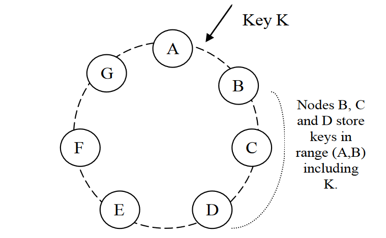

background-image: url(img/athens.jpg)
background-size: cover

# Filary chmur

## Szymon Kulec @Scooletz

???

"Chmura to bzdura". Jeszcze kilka lat temu, takie zdanie można było słyszeć ode mnie w momencie, w którym ktoś wspominał chmurę publiczną. Nie widziałem sensu w tych gigantycznych centrach danych skolokowanych w jednym miejscu. Co jeśli to wszystko zawiedzie? Co jeśli zabraknie miejsca na dane? Co jeśli infrastruktura nie utrzyma obciążenia. Te i podobne pytania pojawiały się w mojej głowie co chwilę. Ostatecznie, zostałem przekonany, czy może przekonałem się sam do instytucji chmury publicznej. Co odpowiedziało na powyższe pytania? Co przekonało mnie, i może przekonać Ciebie? Co pokazało, że chmura faktycznie ma niemałe szanse działania? Dzisiaj chciałbym podzielić się z Tobą moją ścieżką, przez różne elementy chmury publicznej, u różnych prowiderów. Zapraszam do zgłębienia filarów na których stoi chmura.

Nazywam się Szymon Kulec, a to są Filary Chmur.

Co mnie nie przekonało do chmury...

---

background-image: url(img/hype.jpg)
background-size: cover

## Hype / moda / hashtagi

--

- mikroserwisy

--

- skalowalność

--

- każdy to robi

--

- posty a'la _ten najlepszy sposób na ..._

???

---

background-image: url(img/pallette.jpg)
background-size: cover

## Tyyyyle wyborów

--

- 10 baz danych

--

- 5 systemów kolejkowych

--

- 3 sposoby wyszukiwania

--

- 200 rodzajów VMek

---

background-image: url(img/papers.jpg)
background-size: cover

## Papierowe filary

---

background-image: url(img/storage.jpg)
background-size: cover

## Storage: Azure Storage Services

- Queues
- Tables
- Blobs
- Disks

---

background-image: url(img/storage.jpg)
background-size: cover

## Storage: Azure Storage Services (2)

--

- strong consistency

  - Twierdzenie CAP
  - optimistic concurrency

???

- twierdzenie CAP
- namespace'y
- wiele Data Center
- dawanie tych samych danych dla wielu użytkowników

--

- globalna/skalowalna przestrzeń nazw

--

- Disaster Recovery

--

- multi-tenant

---

background-image: url(img/storage.jpg)
background-size: cover

## Storage: Azure Storage Services - przestrzenie nazw

```html
http(s)://{account}.{service}.core.windows.net/{partition}/{object}
```

???

- account - Storage Account
- service - jeden z serwisów
- partition - partycja
- object - pojedynczy obiekt w partycji

- blobs & queues - bez obiektu
- tables - PartitionKey = obiekt

---

background-image: url(img/storage.jpg)
background-size: cover

## Storage: Azure Storage Services - architektura

--

- Storage  Stamp

  - 10 - 20  racków
  - 2PB - 30PB danych
  - wysycenie 70 %

--

- Location Service (LS)

  - zarządza SSami
  - aktualizuje DNSy

---

background-image: url(img/storage.jpg)
background-size: cover

## Storage: Azure Storage Services - architektura - trzy warstwy

--

- Stream Layer

  - "system plików"
  - "pliki" to listy wskaźników do extent'ów
  - extent składa się z bloków
  - replikuje i przechowuje dane bez zrozumienia

--

- Partition Layer

  - rozumie pojęcia: blob, kolejka, tabela
  - partycjonuje dane w Stampie
  - cache'uje dane

--

- Front-End (FE)

  - autentykacja
  - cache mapy partycji
  - może przeskoczyć Partition Layer, dla dużych obiektów

---

background-image: url(img/storage.jpg)
background-size: cover

## Storage: Azure Storage Services - przykład

```html
Request:  
POST https://myaccount.queue.core.windows.net/messages HTTP/1.1  

Headers:  
x-ms-version: 2011-08-18  
x-ms-date: Tue, 30 Aug 2011 01:03:21 GMT  
Authorization: ABC
Content-Length: 100  

Body:  
<QueueMessage>  
<MessageText>base64payload</MessageText>  
</QueueMessage>  
```

???

- wiadomość wysyłana na dany adres
- przechodzi przez Front-End, który znajduje partycję "myaccount->messages"
- partycja znajduje odpowiedni strumień i dodaje do niego wiadomość

---

background-image: url(img/storage.jpg)
background-size: cover

## Storage: Azure Storage Services - replikacja

--

- stream -> extent -> block

--

- do strumienia można tylko dodawać (_append-only_)

--

- _multi-block append_

--

- extent - jednostka replikacji

--

- replikacja zarządzana przez Stream Manager

---

background-image: url(img/storage.jpg)
background-size: cover

## Storage: Azure Storage Services - podsumowanie

--

- CP... ale duże A

--

- partycje, to wszytko partycje

--

- _append-only_

--

- Whitepaper: _Windows Azure Storage: A Highly Available Cloud Storage Service with Strong Consistency_

---

background-image: url(img/time.jpg)
background-size: cover

## Czas: Google TrueTime

--

- _Która godzina?_

???

Jest jedno pytanie, którego boją się wszyscy posiadający wiele DC. Która godzina.

--

- dryft zegara

--

- NTM - Network Time Protocol

???

Google zbudował znacznie lepszą odpowiedź na to.

---

background-image: url(img/time.jpg)
background-size: cover

## Czas: Google TrueTime - składowe

???

Każdy może zbudować w domu takie API

--

- serwer

--

- GPS

--

- zegar atomowy

---

background-image: url(img/time.jpg)
background-size: cover

## Czas: Google TrueTime - API

```c
TT.now() => [from, to]

TT.after(t) => bool

TT.before(t) => bool

const delta = 7ms
```

???

Nie da się określić jednej daty
Dokładność 7ms

---

background-image: url(img/time.jpg)
background-size: cover

## Czas: Google TrueTime - Spanner

- skalowalny

- rozproszony

- partycjonowany (Paxos)

- dwa rodzaje transakcji:

  - Read-Only

  - Read-Write

---

background-image: url(img/time.jpg)
background-size: cover

## Czas: Google TrueTime - Spanner - Read-Only

???

Transakcja odczytująca

--

- użycie `TT.now().latest` dla snapshotu

--

- obsługiwane przez dowolne repliki, które mają tę datę

---

background-image: url(img/time.jpg)
background-size: cover

## Czas: Google TrueTime - Spanner - Read-Write

--

- użycie `TT.now().latest` jako datę commitu

???

Transakcja zapisująca

--

- koordynator oczekuje `2 * delta` co zapewnia że commit jest w przeszłości

---

background-image: url(img/time.jpg)
background-size: cover

## Czas: Google TrueTime - Spanner - liniowość

```C
t1 < t2 < t3 < t4 ...
```

???

Efektywnie oznacza możliwość uliniowienia transakcji, bez wektor clocków itp

---

background-image: url(img/time.jpg)
background-size: cover

## Czas: Google TrueTime (TM) - podsumowanie

--

- super dokładny zegar

--

- umożliwia sortowanie transakcji

--

- liniowość operacji bez zewnętrznych struktur danych

--

- Whitepaper: _Spanner: Google’s Globally Distributed Database_

---

background-image: url(img/pile.jpg)
background-size: cover

## Indeksowanie bez schematu: DocumentDB

--

- czy indeksowanie bez schematu jest możliwe?

--

- czy można indeksować wszystko?

--

- czy można zarządzać przy tym budżetem operacji?

???

Okazuje się że tak.

---

background-image: url(img/pile.jpg)
background-size: cover

## Indeksowanie bez schematu: DocumentDB - kolekcje

--

```js
{
    "Id" : 1,
    "Name" : "Elon",
    "Tags" : ["CEO", "car", "space", "loops", "nosleep"]
}
```

--

```js
{
    "Id" : 2,
    "Name" : "Satya",
    "Tags" : ["CEO", "cloud", "computers", "empower"]
}
```

---

background-image: url(img/pile.jpg)
background-size: cover

## Indeksowanie bez schematu: DocumentDB - struktura

???

- operuje na kolekcjach
- kolekcje - podobne do siebie dokumenty
- dokumenty zapisane jako JSON

--

```js
{
    "Id" : 2,
    "Name" : "Satya",
    "Tags" : ["CEO", "cloud", "computers", "empower"]
}
```

--

| Key  | Value |
|---|---|
| $/Name  | "Satya"  |
| $/Tags/0  | "Ceo"  |

---

background-image: url(img/pile.jpg)
background-size: cover

## Indeksowanie bez schematu: DocumentDB - ekstrakcja indeksu

| Term  | Value |
|---|---|
| $/Name  | 1, 2  |
| $/Name/Elon  | 1 |
| $/Name/Satya  | 2 |
| $/Tags/0  | 1, 2 |
| $/Tags/0/CEO  | 1, 2 |

???

- dokument JSON podzielony na części
- możliwe jest zmapowanie (term, docid)
- zbliżone dokumenty indeksowane w efektywny sposób

---

background-image: url(img/pile.jpg)
background-size: cover

## Indeksowanie bez schematu: DocumentDB - więcej opcji

```C

$/Tags/0/CEO          // full forward
CEO/0/Tags/Name/$     // full reverse

Tags/0/CEO            // partial forward
CEO/0/Tags            // partial reverse
```

???

- dużo możliwości
- koszt generowania i przechowywania
- wyważenie względem zapytań

---

background-image: url(img/pile.jpg)
background-size: cover

## Indeksowanie bez schematu: DocumentDB - kwerendy

--

#### Kwerenda 1

```sql
SELECT * FROM People WHERE Tags[0] == "CEO"
```

--

```C
CEO/0/Tags  // partial reverse
```

--

#### Kwerenda 2

```sql
SELECT * FROM People WHERE Tags.Count >= 5
```

--

```C
$/Tags/4 // full forward
```

???

- mają tag "4" - mają przynajmniej 5

---

background-image: url(img/pile.jpg)
background-size: cover

## Indeksowanie bez schematu: DocumentDB - konfiguracja indeksów

--

- pola: włączanie/wyłączanie z indeksu

--

- typy: hash, range, spatial, text

--

- tryb: Consistent, Lazy

---

background-image: url(img/pile.jpg)
background-size: cover

## Indeksowanie bez schematu: DocumentDB - budżet

--

- multi-tenant

--

- budżet IO dla każdej operacji

--

- oczekiwanie, jeśli budżet przekroczony

---

background-image: url(img/pile.jpg)
background-size: cover

## Indeksowanie bez schematu: DocumentDB - podsumowanie

--

- (prawie)agnostyczne indeksowanie jest możliwe

--

- autokompresja podobnych schematów

--

- budżetowanie operacji

--

- Whitepaper: _Schema-Agnostic Indexing with Azure DocumentDB_

---

background-image: url(img/wine.jpg)
background-size: cover

## DynamoDB - dojrzały, rozproszony rocznik ‎2007

--

Key-value store, który zainspirował wiele baz danych

--

- partycjonowanie (_partitioning_)

- wysoka dostępność dla zapisów (_HA_)

- odtwarzanie (_recovery_)

---

background-image: url(img/wine.jpg)
background-size: cover

## DynamoDB - partycjonowanie - Consistent Hashing



???

- węzły A, B, C, D, E, ... ułożone w koło

- hash dla wartości klucza

- jednorodne rozmieszczenie, łatwe przechwytywanie

---

background-image: url(img/wine.jpg)
background-size: cover

## DynamoDB - partycjonowanie - wysoka dostępność

--

- zawsze przyjmuj zapis (_Put (key, value)_)

--

- zapisuj wersję z tzw. _vector clock_

--

- jeśli jest konflikt, zaraportuj go przy odczytywaniu

???

- vector clock, nawiąż do Spanner TrueTime

- logika biznesowa przy odczytywaniu

---

background-image: url(img/wine.jpg)
background-size: cover

## DynamoDB - partycjonowanie - wysoka dostępność (2)

```C
// writer x
Put("a", _) // [("x", 1)]

// writer x
Put("a", _) // [("x", 2)]

// writer y & z
Put("a", _); // [("x", 2), ("y", 1)]
Put("a", _); // [("x", 2), ("z", 1)]

// writer x
Get ("a")   // conflict & resolve

Put ("a", _) // [("x", 3), ("y", 1), ("z", 1)]
```

???

- vector clock, opisz scenariusz zapisów

- biznesowa logika do roztrzygania sporów

---

background-image: url(img/wine.jpg)
background-size: cover

## DynamoDB - dojrzały, rozproszony rocznik ‎2007 - podsumowanie

--

- jedna z baz, którą _musisz znać (TM)_

--

- przodek kolejnych pokoleń baz

--

- Whitepaper: _Dynamo: Amazon’s Highly Available Key-value Store_

---

background-image: url(img/book.jpg)
background-size: cover

# Filary chmur - podsumowanie

--

- Azure Storage Services

--

- Google TrueTime & Spanner

--

- Azure DocumentDB

--

- Amazon DynamoDB

---

background-image: url(img/papers.jpg)
background-size: cover

# Filary chmur - podsumowanie - co dalej

- Whitepapers

--

- Whitepapers

--

- Whitepapers

--

- Whitepapers

--

- Whitepapers

--

- Whitepapers

---

background-image: url(img/athens.jpg)
background-size: cover

# Filary chmur

## Szymon Kulec @Scooletz